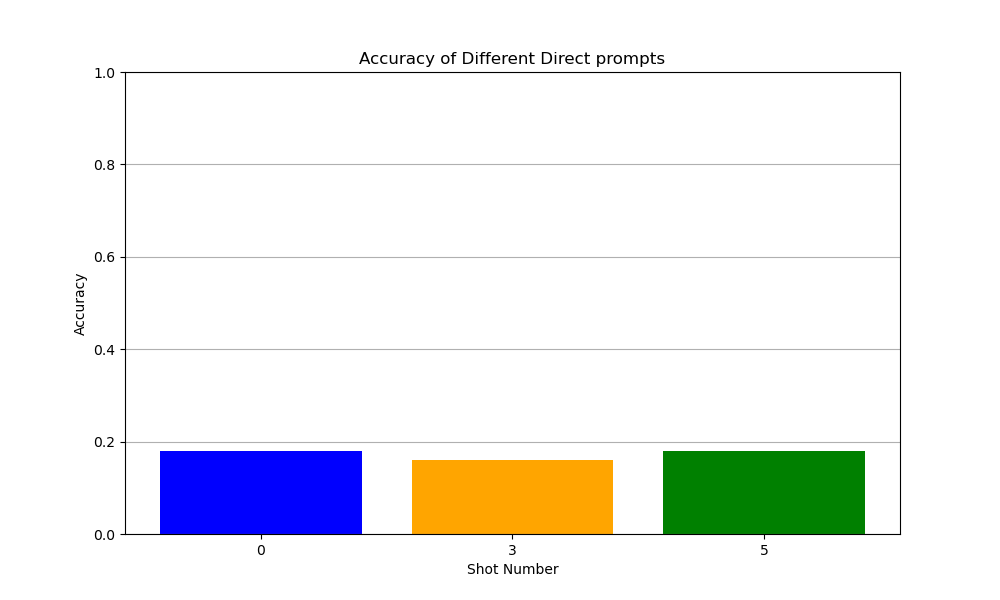
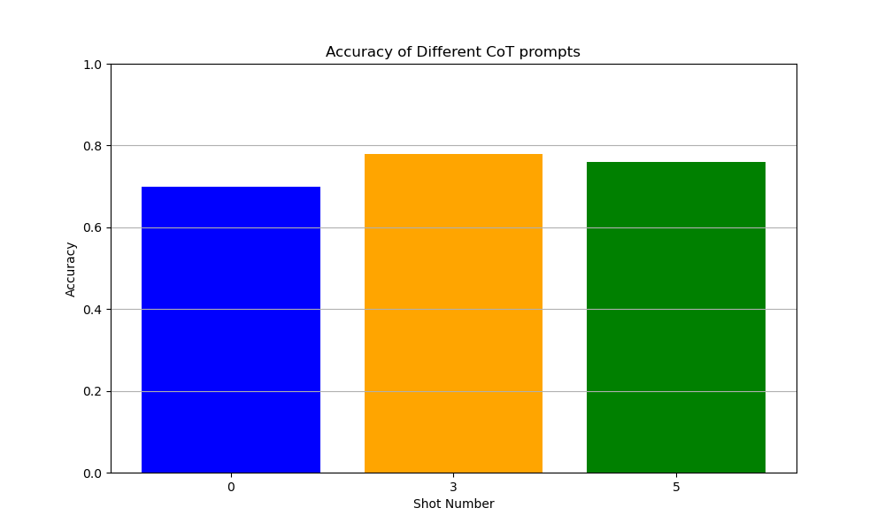
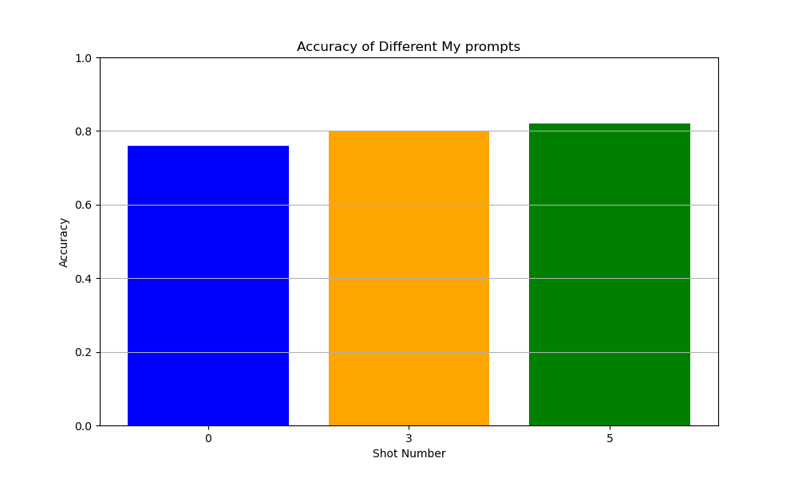
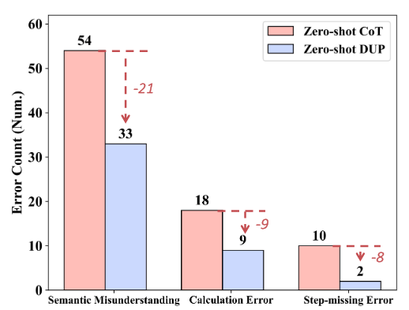

# 프롬포팅 보고서
강성우

## 1. Direct Prompting, CoT Prompting, My Prompting을 0 shot, 3 shot, 5 shot 정답률을 표로 보여주세요!
Direct Prompting:

CoT Prompting:

My Prompting:

My Prompting이 0, 3, 5 shot에서 모두 우위를 점하고있다.

## 2. CoT Prompting이 Direct Prompting에 비해 왜 좋을 수 있는지에 대해서 서술해주세요!

CoT는 입력값 x에 대해 출력값 y가 비자명할때, 여러개의 자명한 중간 생각들을 매개채로 삼아, LLM이 비 자명한 관계에 약하더라도 중간 생각들을 체인처럼 이어서 비 자명한 출력값 y를 얻을 수 있게 하므로 CoT Prompting이 Direct Prompting에 비해 좋을 수 있습니다.

## 3. 본인이 작성한 프롬프트 기법이 CoT에 비해서 왜 더 좋을 수 있는지에 대해서 설명해주세요!

[Achieving >97% on GSM8K: Deeply Understanding the Problems Makes LLMs Better Solvers for Math Word Problems](https://arxiv.org/abs/2404.14963)
논문을 보고 참고했습니다.

### DUP-s
논문에서는 수학 문제와 같은 문제에서는 문제 풀이와 관련 없는 정보가 많기 떄문에, LLM이 핵심 내용 파악과 문제 해결에 필요한 정보를 추출하지 못할 수 있으며, 이런 이유 때문에 CoT과정에서 의미적 오해와 낮은 성과를 불러일으킨다고 말한다.

논문에서 제안한 DUP(Deeply Understanding the Problems)는
1. 핵심내용 파악,
2. 문제 해결에 필요한 정보 추출
3. 위의 정보를 융합한 정답 풀이 과정

을 명시적으로 실시하게해 성능을 올릴 수 있다고 주장한다.

DUP는 여러번의 요청 대신 과정을 지시하는 한개의 프롬포트로도 할 수 있는데, 논문에서는 이를 DUP-s 라고 칭한다. 내가 작성한 프롬포트 기법은 DUP-s를 수정한 내용이기 때문에 LLM은 문제 이해를 잘 해 CoT보다 더 나은 성과를 낼 수 있을것이다.

DUP-s 결과:

각각 0.76, 0.8, 0.82

### + 앙상블

CoT-SC 에 영감을 받아, 이 프롬포트으로 더 나은 성능을 내기 위해서 3개를 돌려 가장 많이 나온 값 투표해 결과값으로 선정해보자. 

만일 어떤 프롬포트가 특정 문제를 맞추는 확률을 p라고 하면, 3번 던질때 k가 문제를 맞춘 횟수라고 하면 $K \sim B(3, p)$ 이며, 투표로 나온 결과가 맞는 확률은 $P(K \geq 2)$보다 크거나 같다(셋다 다른 결과를 내는 경우의 수를 고려하면 확실히 더 클것이다).

즉, $P(K \geq 2) = 3p^2(1-p)+p^3 = -2p^3+3p^2$ 이며, p가 [0, 1] 의 값임을 생각하면 $-2p^3+3p^2>p \Rightarrow -2p^2+3p-1>0 \Rightarrow -2(x-0.5)(x-1)$ 이므로 $p>0.5$일때 $P(K \geq 2)$가 투표 없이 맞을 확률보다 크고, 그러므로 투표로 나온 결과가 맞는 확률이 투표 없이 맞을 확률보다 크다.

물론 문제마다 난이도가 다르므로 위와 같은 식으로 앙상블시 얼마나 정답률이 나올지 정확한 계산은 힘들것이다. 

최종 결과:

각각 0.8, 0.84, 0.82