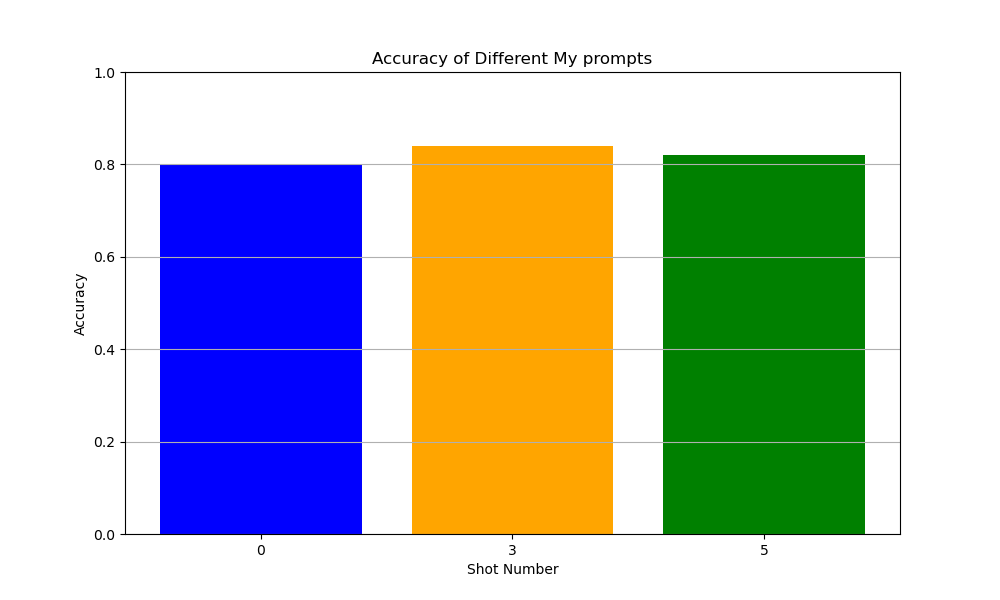

# 프롬포팅 보고서
강성우

## 1. Direct Prompting, CoT Prompting, My Prompting을 0 shot, 3 shot, 5 shot 정답률을 표로 보여주세요!
Direct Prompting:

CoT Prompting:

My Prompting:

My Prompting이 0, 3, 5 shot에서 모두 우위를 점하고있다.

## 2. CoT Prompting이 Direct Prompting에 비해 왜 좋을 수 있는지에 대해서 서술해주세요!

CoT는 입력값 x에 대해 출력값 y가 비자명할때, 여러개의 자명한 중간 생각들을 매개채로 삼아, LLM이 비 자명한 관계에 약하더라도 중간 생각들을 체인처럼 이어서 비 자명한 출력값 y를 얻을 수 있게 하므로 CoT Prompting이 Direct Prompting에 비해 좋을 수 있습니다.

## 3. 본인이 작성한 프롬프트 기법이 CoT에 비해서 왜 더 좋을 수 있는지에 대해서 설명해주세요!

[Achieving >97% on GSM8K: Deeply Understanding the Problems Makes LLMs Better Solvers for Math Word Problems](https://arxiv.org/abs/2404.14963)
논문을 보고 참고했습니다.

논문에서는 수학 문제와 같은 문제에서는 문제 풀이와 관련 없는 정보가 많기 떄문에, LLM이 핵심 내용 파악과 문제 해결에 필요한 정보를 추출하지 못할 수 있으며, 이런 이유 때문에 CoT과정에서 의미적 오해와 낮은 성과를 불러일으킨다고 말한다.

논문에서 제안한 DUP(Deeply Understanding the Problems)는
1. 핵심내용 파악,
2. 문제 해결에 필요한 정보 추출
3. 위의 정보를 융합한 정답 풀이 과정

을 명시적으로 실시하게해 성능을 올릴 수 있다고 주장한다.

DUP는 여러번의 요청 대신 과정을 지시하는 한개의 프롬포트로도 할 수 있는데, 논문에서는 이를 DUP-s 라고 칭한다. 내가 작성한 프롬포트 기법은 DUP-s를 수정한 내용이기 때문에 LLM은 문제 이해를 잘 해 CoT보다 더 나은 성과를 낼 수 있을것이다.